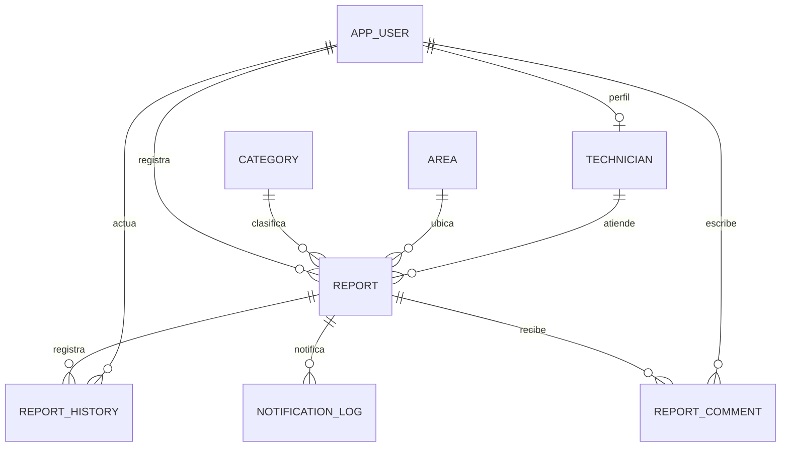

# Backend FixCampus

Monolito didáctico Java 17 y Spring Boot 3.5, API REST documentada con OpenAPI. Los controladores reciben DTO, los servicios aplican reglas de negocio y los repositorios JPA guardan entidades. No se emplea Lombok para facilitar la lectura.

## Ejecutar

Instalar JDK 17 y Maven 3.9+. En esta carpeta:

```powershell
$env:SEED_ENABLED='true'
$env:SEED_PASSWORD='una-clave-local-de-al-menos-12-caracteres'
mvn spring-boot:run
```

El primer arranque crea cuentas de demostración `admin@fixcampus.local`, `reporter@fixcampus.local`, `other@fixcampus.local` y `technician@fixcampus.local`, todas con la contraseña indicada en `SEED_PASSWORD`. Las contraseñas se guardan con BCrypt. El sembrado no altera cuentas existentes. Desactivar `SEED_ENABLED` al terminar. Nunca activar datos de demostración en un despliegue público.

Swagger: <http://localhost:8080/swagger-ui.html>. La base H2 persiste en `data/`, fuera del código. Pruebas: `mvn test`. Ejecutable: `mvn package` y `java -jar target/fixcampus-1.0.0.jar`.

## Modelo relacional



`app_user`: id, name, email único, password_hash, role, active. `category` y `area`: id, name único, description, active. `technician`: id, user_id único, specialty, active. `report`: id, title, description original, location, category_id, area_id, reporter_id, technician_id nullable, priority, status, created_at, updated_at, resolved_at, closed_at, version. `report_history`: id, report_id, actor_id, from_status, to_status, note, created_at. `notification_log`: id, report_id, recipient, status, detail, created_at.
`report_comment`: id, report_id, author_id, body, created_at. Los comentarios quedan asociados a un reporte y a la cuenta que los escribió; reportante, técnico asignado y administrador pueden consultarlos y agregarlos.

## Reglas

El reportante ve sus incidencias; el técnico ve las asignadas; el administrador ve todas. Solamente un reporte NEW puede editarse o borrarse. Los catálogos, usuarios y perfiles se desactivan para conservar referencias. Cada cambio de estado conserva actor, hora y comentario.

Flujo: NEW → ASSIGNED → IN_PROGRESS → RESOLVED → CLOSED. El administrador asigna y reasigna; el técnico asignado inicia y resuelve; el reportante confirma el cierre. El administrador también puede ejecutar las transiciones. Resolver exige describir la solución. No se permite saltar etapas.

La API usa sesión HTTP y CSRF. Obtener `/api/auth/csrf`, enviar `token` con el encabezado `headerName` en POST/PUT/DELETE y volver a obtenerlo después de iniciar o cerrar sesión. El proxy de Angular mantiene el mismo origen. No se guardan contraseñas ni tokens de sesión en localStorage.

## Integraciones

La sugerencia IA usa HTTP con `AI_API_KEY`, `AI_MODEL` y `AI_URL` (endpoint compatible con chat completions). Valida JSON, categoría existente, prioridad y longitud del contenido. La respuesta es una propuesta que el usuario debe revisar. Sin credencial o con error, devuelve `source: MANUAL`, categoría sin seleccionar y prioridad MEDIUM; este resultado **no es IA**. El texto original del reporte se conserva. Enviar una descripción a IA implica transmitir ese texto al proveedor configurado.

Resend usa `RESEND_API_KEY` y `EMAIL_FROM`. El remitente debe estar verificado por el proveedor. La asignación registra SENT, FAILED o SKIPPED. Un problema del correo no revierte la asignación. No se afirma entrega al buzón: SENT significa aceptación de la API. Las credenciales reales y la entrega externa requieren configuración y prueba por el equipo.

## PostgreSQL y despliegue

Los pasos para conectar PostgreSQL desde IntelliJ están en `POSTGRESQL_INTELLIJ.md`. No se deben guardar credenciales reales en `application.properties`.

Configurar `DB_URL=jdbc:postgresql://host:5432/fixcampus`, `DB_USERNAME` y `DB_PASSWORD`. `DDL_AUTO=update` facilita las prácticas; para producción deben prepararse migraciones versionadas antes de usar `validate`, HTTPS y `COOKIE_SECURE=true`, secretos del proveedor, copias de seguridad y pruebas de concurrencia/carga. El proyecto no incluye despliegue público realizado.

Alcance: sin adjuntos ni recuperación de contraseña; no incorpora SLA, inventario ni WebSockets. Las métricas se calculan sobre reportes visibles para cada rol y el promedio considera reportes con fecha de resolución, incluidos los cerrados.

Referencias: [requisitos de Spring Boot 3.5](https://docs.spring.io/spring-boot/3.5/system-requirements.html), [Spring Security CSRF](https://docs.spring.io/spring-security/reference/servlet/exploits/csrf.html), [Resend Send Email](https://resend.com/docs/api-reference/emails/send-email).
