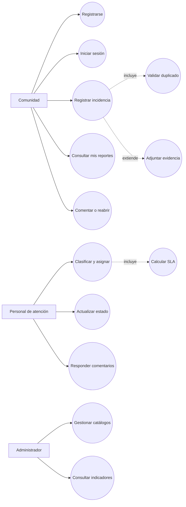

# FixCampus — Casos de Uso

## Actores

| Actor | Responsabilidad |
|---|---|
| Comunidad | Registra incidencias y consulta el avance de las que creó. |
| Personal de atención | Revisa, prioriza, comenta y actualiza incidencias asignadas. |
| Administrador | Administra usuarios, categorías, ubicaciones y métricas. |
| Servicio de autenticación | Valida credenciales y emite el token de sesión. |

## Mapa de casos de uso

## CU-01 — Registrar una incidencia

**Actor principal:** Comunidad  
**Objetivo:** dejar una incidencia con información suficiente para que pueda ser ubicada y atendida.  
**Nivel:** objetivo de usuario.  
**Prioridad:** Must.

### Precondiciones

1. La cuenta está activa y el usuario inició sesión.
2. Existe al menos una categoría y una ubicación disponibles.
3. La API está disponible.

### Flujo principal

1. El usuario entra a “Reportar”.
2. El sistema carga categorías, ubicaciones y sus identificadores.
3. El usuario escribe título, descripción y detalle del lugar.
4. El usuario selecciona categoría y ubicación.
5. El sistema valida los campos obligatorios.
6. El sistema envía `POST /api/reports` con el token del usuario.
7. El backend asocia el reporte al usuario autenticado, asigna estado `ABIERTO` y guarda la fecha.
8. El sistema muestra confirmación y actualiza “Mis reportes”.

### Flujos alternativos y excepciones

- **A1 — Datos incompletos:** en el paso 5 se marca el formulario y no se realiza la petición.
- **A2 — Sesión vencida:** en el paso 6 la API responde `401`; el usuario vuelve a iniciar sesión.
- **A3 — Catálogo vacío:** el formulario informa que un administrador debe configurar categorías o ubicaciones.
- **A4 — Falla de red:** se conserva la información escrita, se detiene el indicador de carga y se ofrece reintentar.
- **A5 — Posible duplicado:** en la siguiente iteración se muestra el reporte parecido y el usuario decide si continúa.

### Postcondiciones

- El reporte queda persistido con un identificador.
- El usuario puede verlo en su lista.
- Se genera el primer evento de la línea de tiempo.

## CU-02 — Gestionar el ciclo de atención

**Actor principal:** Personal de atención  
**Actores secundarios:** Comunidad y servicio de notificaciones.  
**Objetivo:** llevar un reporte desde la recepción hasta el cierre con responsable y trazabilidad.

### Flujo principal

1. El personal consulta la bandeja de reportes abiertos.
2. Filtra por prioridad, categoría, campus o fecha.
3. Abre el detalle y revisa descripción, ubicación y evidencia.
4. Asigna responsable y fecha objetivo.
5. El sistema registra la asignación y calcula el SLA.
6. El responsable cambia el estado a `EN_ATENCION` y agrega una nota.
7. Al resolver, registra la solución y cambia a `RESUELTO`.
8. El reportante recibe la actualización y puede confirmar o reabrir dentro del plazo.
9. El sistema cierra el reporte conservando todo el historial.

### Reglas de negocio

- Un usuario no puede asignarse un reporte si no tiene rol de atención.
- Un reporte crítico requiere una justificación de prioridad.
- `RESUELTO` exige una nota de solución.
- Reabrir exige un motivo y crea una nueva transición, no borra el historial.

## CU-03 — Mantener categorías y ubicaciones

**Actor principal:** Administrador  
**Objetivo:** mantener los catálogos que usa la comunidad para describir la incidencia.

### Flujo principal

1. El administrador abre Swagger o el módulo de configuración.
2. Consulta el catálogo actual.
3. Crea o edita el registro con sus campos obligatorios.
4. El backend valida nombres y devuelve `201` o `200`.
5. El formulario de reporte obtiene el nuevo catálogo al cargar.

### Alternativas

- Un nombre duplicado devuelve un error de validación.
- Un usuario sin rol administrador recibe `403`.
- Una ubicación usada por reportes no se borra físicamente; se marca inactiva en la evolución propuesta.

## CU-04 — Consultar indicadores de operación

**Actor principal:** Administrador  
**Objetivo:** identificar dónde se concentran las incidencias y si se están cumpliendo los tiempos de atención.

### Flujo principal

1. El administrador selecciona rango de fechas y campus.
2. El sistema calcula totales por estado, categoría y ubicación.
3. El sistema muestra tarjetas y una tabla con el detalle agregado.
4. El administrador puede exportar el resultado sin datos personales.

### Validaciones

- El rango final no puede ser anterior al inicial.
- Los reportes sin categoría o ubicación válida se muestran en una sección de datos por revisar.
- Los valores del tablero deben coincidir con la consulta de reportes para el mismo filtro.

## Contratos de los casos principales

| Caso | Entrada | Resultado | Error relevante |
|---|---|---|---|
| CU-01 | título, descripción, categoría, ubicación, token | `201` + `idReporte` | `400`, `401`, `404` |
| CU-02 | reporte, responsable, estado, comentario | `200` + historial actualizado | `403`, transición inválida |
| CU-03 | datos de categoría/ubicación + rol admin | `201` o `200` | duplicado, `403`, `404` |
| CU-04 | filtros de fecha/campus + rol admin | indicadores agregados | rango inválido, `403` |
