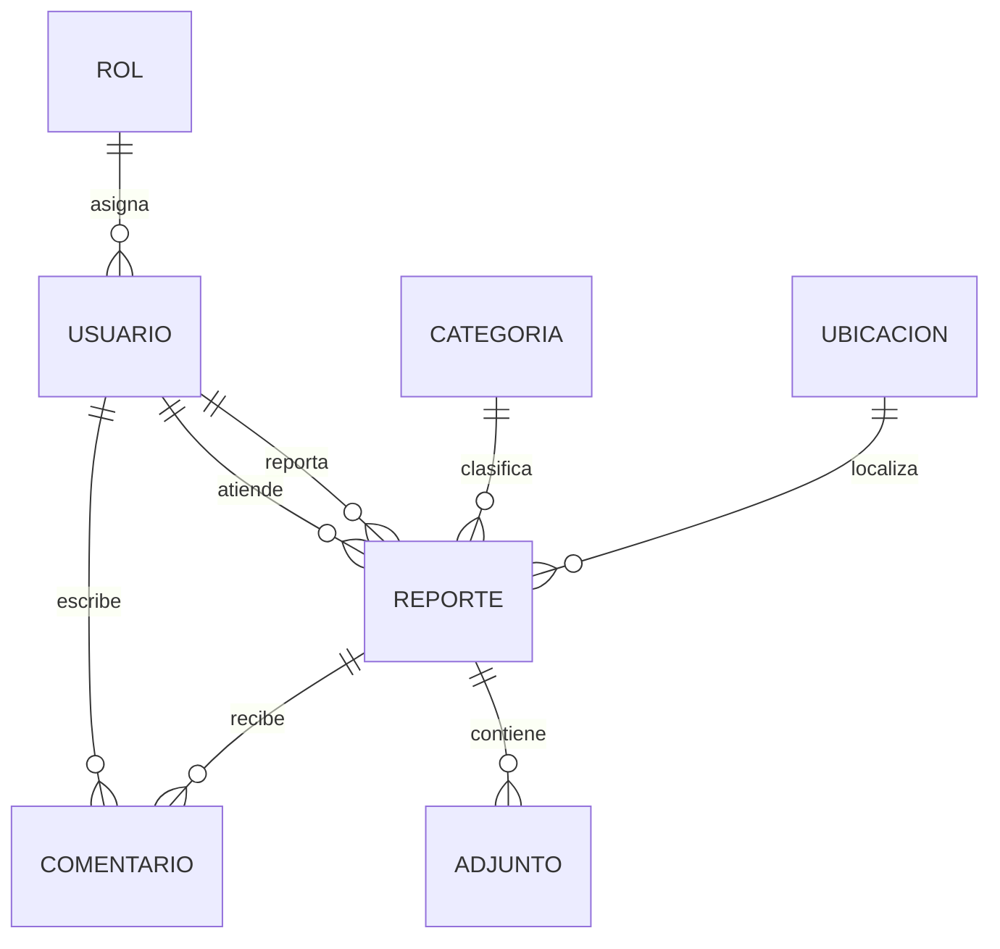

# FixCampus — Especificación funcional y técnica

## 1. Propósito

FixCampus centraliza incidencias de espacios del campus. El sistema captura el contexto mínimo para actuar —qué pasó, dónde y de qué tipo— y deja una consulta posterior para la persona que reportó.

## 2. Alcance actual

### Incluido y demostrable

- Registro de cuenta y autenticación con token.
- Catálogos de categorías y ubicaciones consultados por el frontend.
- Registro de incidencias con categoría, ubicación, detalle, descripción, prioridad y estado.
- Consulta de reportes propios.
- CRUD de entidades principales en la API protegido por roles.
- Documentación OpenAPI disponible en Swagger.

### Fuera del flujo web actual

- Carga de archivos desde la interfaz.
- Bandeja visual para personal de atención.
- Notificaciones automáticas y cálculo programado de SLA.
- Línea de tiempo y conversación en la pantalla de detalle.

Estos puntos están documentados como historias de la siguiente iteración; no se presentan como terminados.

## 3. Reglas funcionales

| Código | Regla |
|---|---|
| RF-01 | Solo una cuenta activa puede crear un reporte. |
| RF-02 | El correo de usuario es único. |
| RF-03 | Un reporte requiere título, descripción, categoría y ubicación. |
| RF-04 | Todo reporte nuevo inicia en estado `ABIERTO`. |
| RF-05 | Un usuario consulta únicamente sus propios reportes desde “Mis reportes”. |
| RF-06 | Los catálogos se mantienen centralizados para evitar valores inconsistentes. |
| RF-07 | Las operaciones de administración requieren rol `ADMIN`. |
| RF-08 | Las contraseñas se guardan como hash y no forman parte de las respuestas. |

## 4. Roles y permisos

| Recurso | Comunidad | Administrador |
|---|---:|---:|
| Registrarse / iniciar sesión | Sí | Sí |
| Consultar categorías y ubicaciones | Sí | Sí |
| Crear y consultar mis reportes | Sí | Sí |
| CRUD de categorías | No | Sí |
| CRUD de ubicaciones | No | Sí |
| CRUD de usuarios, roles y reportes | No | Sí |
| Consultar indicadores | No | Sí |

## 5. API actual

Base local: `http://127.0.0.1:8080`  
Swagger: `http://localhost:8080/swagger-ui/index.html`  
OpenAPI: `http://localhost:8080/v3/api-docs`

| Módulo | Endpoints principales | Permiso |
|---|---|---|
| Registro | `POST /registro` | Público |
| Login | `POST /login` | Público |
| Reportes propios | `GET /api/reports/mis-reportes` | `ADMIN` o `USUARIO` |
| Reportes | `GET/POST/PUT/DELETE /api/reports` | Según operación |
| Categorías | `GET/POST/PUT/DELETE /api/categories` | Consulta autenticada / cambios admin |
| Ubicaciones | `GET/POST/PUT/DELETE /api/locations` | Consulta autenticada / cambios admin |
| Usuarios | `GET/POST/PUT/DELETE /api/users` | Admin |
| Roles | `GET/POST/PUT/DELETE /api/roles` | Admin |
| Adjuntos | `GET/POST/PUT/DELETE /api/attachments` | Admin en el alcance actual |
| Comentarios | `GET/POST/PUT/DELETE /api/comments` | Según operación |
| Recomendaciones | `GET/POST/PUT/DELETE /api/recomendaciones` | Según operación |
| Indicadores | `GET /api/reports/estadisticas/por-usuario-mes`, `GET /api/reports/estadisticas/por-campus` | Admin |

## 6. Contrato de creación de reporte

### Solicitud

```json
{
  "categoriaId": 10,
  "ubicacionId": 7,
  "titulo": "WiFi no disponible",
  "descripcion": "No hay conexión a la red en la biblioteca.",
  "detalleUbicacion": "Sala de lectura",
  "prioridad": "MEDIA",
  "estado": "ABIERTO"
}
```

El frontend envía el token en `Authorization: Bearer <token>`. El backend obtiene el usuario autenticado y guarda la relación, por lo que el usuario no debe poder hacerse pasar por otra cuenta.

### Respuestas esperadas

- `201 Created`: reporte guardado con `idReporte`.
- `400 Bad Request`: datos obligatorios inválidos.
- `401 Unauthorized`: token ausente o vencido.
- `403 Forbidden`: rol sin permiso.
- `404 Not Found`: categoría o ubicación inexistente.

## 7. Modelo de datos



La relación de `REPORTE` con `CATEGORIA` y `UBICACION` evita guardar texto libre repetido. `ADJUNTO` y `COMENTARIO` están modelados para la ampliación del seguimiento.

## 8. Arquitectura

```text
Angular 22 (frontend)
        │ HTTP + Bearer token
        ▼
Spring Boot 4 / Spring Security / Spring Data JPA
        │ JDBC
        ▼
PostgreSQL (base fixcampus)
```

### Capas del backend

- `controllers`: rutas HTTP y códigos de respuesta.
- `servicesinterfaces`: contratos de negocio.
- `servicesimpl`: reglas, asociaciones y consultas.
- `repositories`: acceso a PostgreSQL mediante JPA.
- `entities`: entidades persistentes.
- `dtos`: contratos de entrada y salida.
- `config`: seguridad, CORS y datos iniciales.

### Decisiones técnicas

1. El frontend obtiene catálogos por API para que los cambios del administrador no requieran recompilarlo.
2. El backend valida rol y token; ocultar un botón en Angular no se considera seguridad.
3. `DataInitializer` agrega categorías y ubicaciones faltantes sin duplicarlas cuando la aplicación reinicia.
4. La base local usa PostgreSQL en el puerto `5433`; las pruebas automáticas usan H2 aislado.
5. Swagger sirve para revisar contratos y probar operaciones administrativas sin inventar una pantalla que todavía no existe.

## 9. Requisitos no funcionales

| Código | Requisito | Verificación |
|---|---|---|
| RNF-01 | La contraseña no aparece en logs ni respuestas. | Revisión de DTO y prueba de registro. |
| RNF-02 | Las operaciones privadas requieren autenticación. | Petición sin token debe devolver `401`. |
| RNF-03 | Un error de red debe liberar el botón del formulario. | Desconectar API y repetir envío. |
| RNF-04 | El formulario debe poder usarse con teclado. | Navegación con Tab y etiquetas visibles. |
| RNF-05 | El backend debe responder errores con un código claro. | Pruebas `400`, `401`, `403` y `404`. |
| RNF-06 | La aplicación debe poder levantar en otra máquina con variables de entorno. | Cambiar `DB_URL`, `DB_USERNAME`, `DB_PASSWORD` y `PORT`. |

## 10. Matriz de pruebas para la entrevista

| Prueba | Paso | Resultado esperado |
|---|---|---|
| P-01 | Registrar cuenta nueva | `201` y mensaje de confirmación |
| P-02 | Repetir correo | Error sin crear una segunda cuenta |
| P-03 | Login válido | Redirección a `/reportar` |
| P-04 | Login inválido | Mensaje y permanencia en acceso |
| P-05 | Abrir reportar | Categorías y ubicaciones cargadas |
| P-06 | Enviar sin título | Validación local, no hay `POST` |
| P-07 | Enviar reporte válido | `201` y aparece en Mis reportes |
| P-08 | Consultar sin token | `401` |
| P-09 | CRUD de catálogo como usuario | `403` |
| P-10 | CRUD de catálogo como admin | `201`, `200` o `204` según operación |

## 11. Evidencias que conviene llevar

- Captura del formulario con catálogos cargados.
- Captura de Swagger con `POST /api/reports` y respuesta `201`.
- Captura del caso de error de validación.
- Historial de cambios de este documento o commit asociado.
- Diagrama de datos y matriz de trazabilidad.
