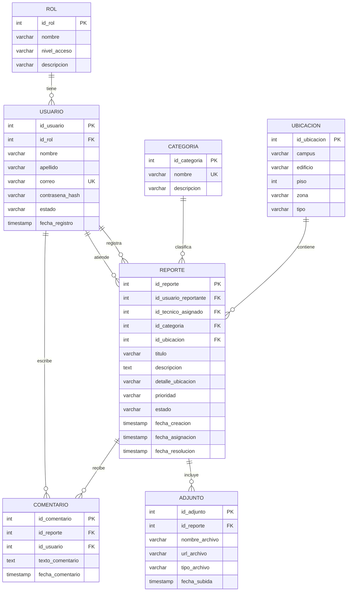

# Modelo Entidad-Relación final - FixCampus

## Entidades

## Decisiones de corrección

- `COMENTARIO` pertenece a un `REPORTE` y lo escribe un `USUARIO`.
- Un reporte puede tener muchos comentarios.
- Un usuario puede escribir muchos comentarios.
- Un reporte puede tener varios adjuntos.
- `REPORTE.id_tecnico_asignado` referencia a `USUARIO.id_usuario`; el rol del usuario determina si puede atender reportes.
- Las claves foráneas mantienen la trazabilidad entre usuario, categoría, ubicación, reporte, adjuntos y comentarios.

## Flujo representado

Un usuario registra un reporte indicando su categoría y ubicación. El reporte puede ser asignado a otro usuario con rol técnico, recibir adjuntos y registrar comentarios durante su atención.
