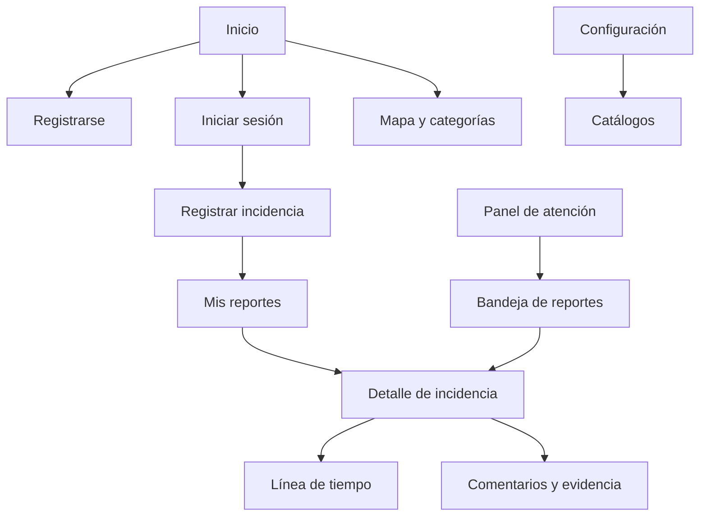

# FixCampus — Prototipo funcional

Este prototipo prioriza el recorrido que se puede probar en la web: acceso, registro de una incidencia y seguimiento. Las pantallas de operación se dejan como siguiente iteración y se marcan como propuesta.

## Arquitectura de pantallas



## Pantallas implementadas

### 1. Inicio

**Objetivo:** explicar el problema que resuelve FixCampus y llevar al usuario a reportar.

```text
┌─────────────────────────────────────────────────────────┐
│ FixCampus       Inicio  Beneficios  Mapa  Reportar      │
├─────────────────────────────────────────────────────────┤
│ Un mejor campus empieza contigo                         │
│ Reporta un problema y consulta su avance.               │
│                                                         │
│ [Registrar una incidencia]        Foto del campus       │
├─────────────────────────────────────────────────────────┤
│ Cómo funciona: describe → ubicamos → damos seguimiento  │
└─────────────────────────────────────────────────────────┘
```

### 2. Registro e inicio de sesión

**Objetivo:** crear una cuenta y entrar con una sesión válida.

```text
┌──────────────────────────────────────┐
│ Regístrate en FixCampus              │
│ Nombre       [____________________]  │
│ Apellido     [____________________]  │
│ Correo       [____________________]  │
│ Contraseña   [____________________]  │
│                                      │
│              [Crear mi cuenta]       │
│ ¿Ya tienes cuenta? Inicia sesión     │
└──────────────────────────────────────┘
```

**Estados que deben verse:** formulario vacío, validación de campos, cuenta creada, correo repetido, API no disponible.

### 3. Registrar incidencia

**Objetivo:** capturar información estructurada para evitar reportes ambiguos.

```text
┌──────────────────────────────────────────────────────┐
│ Registrar reporte                                    │
│ Título       [Proyector averiado________________]    │
│ Categoría    [Equipamiento ▼]                       │
│ Ubicación    [Monterrico · B ▼]                     │
│ Detalle      [Aula 301, junto a la puerta________]  │
│ Descripción  [No enciende desde esta mañana______]  │
│                                                      │
│                         [Enviar reporte]             │
└──────────────────────────────────────────────────────┘
```

**Estados que deben verse:** cargando catálogos, catálogo vacío, campos incompletos, enviando, confirmación y error de servidor.

### 4. Mis reportes

```text
┌──────────────────────────────────────────────────────┐
│ Mis reportes                              [2]         │
├──────────────────────────────────────────────────────┤
│ ABIERTO  Electricidad                                │
│ Luz apagada en aula                                   │
│ Monterrico · A · Aula 201                             │
├──────────────────────────────────────────────────────┤
│ RESUELTO Equipamiento                                 │
│ Proyector averiado                                    │
│ Monterrico · B · Aula 301                             │
└──────────────────────────────────────────────────────┘
```

Si no hay reportes, se muestra una explicación breve y el acceso al formulario.

## Pantallas propuestas para la siguiente iteración

### Detalle y línea de tiempo

- Encabezado con ID, estado, prioridad y fecha de creación.
- Ubicación completa y evidencia adjunta.
- Línea de tiempo: abierto → revisado → asignado → en atención → resuelto.
- Comentarios públicos y notas internas diferenciadas.
- Acción “Reabrir” disponible solo durante el plazo definido.

### Bandeja del personal de atención

- Filtros por estado, prioridad, campus, categoría y vencimiento.
- Orden por SLA y antigüedad.
- Acción rápida para asignar responsable y cambiar prioridad.
- Vista de detalle sin perder los filtros de la bandeja.

### Configuración y dashboard

- CRUD de categorías y ubicaciones con confirmación antes de retirar un registro usado.
- Indicadores por mes, campus, categoría y estado.
- Exportación CSV sin correos ni contraseñas.

## Decisiones de diseño

1. El formulario usa catálogos para que “wifi”, “Wi-Fi” y “Internet” no terminen como tres categorías diferentes.
2. El botón de envío tiene estados claros y nunca confirma un reporte antes de recibir la respuesta de la API.
3. La información importante se mantiene visible en móvil: estado, título, ubicación y fecha.
4. Los mensajes de error explican el siguiente paso y no muestran trazas técnicas.
5. La interfaz distingue lo que está implementado de lo que está planificado para no presentar una maqueta como producto terminado.
